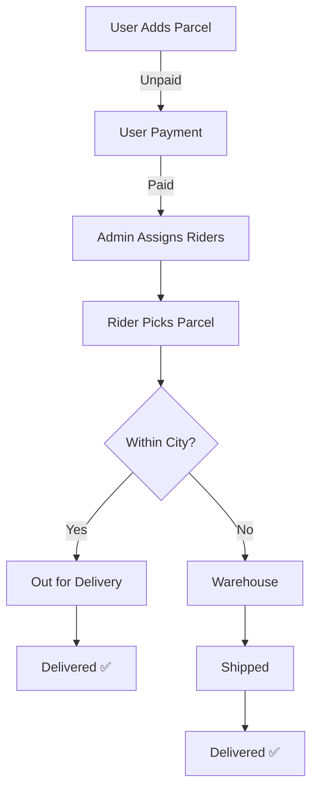

# 🚚 ZAPSHIFT — Parcel Delivery Management System

ZAPSHIFT is a **full-stack door-to-door parcel delivery management platform** designed to streamline booking, tracking, payment, and delivery operations across Bangladesh.

The system provides a modern logistics workflow with **real-time tracking**, **role-based dashboards**, and **secure delivery confirmation**, ensuring efficient and transparent parcel management.

---

## 🌐 Live Website
- 🔗 https://simple-firebase-auth-c54cc.web.app
- 🔗 https://zap-shift-currier-service.netlify.app

## 💻 Client Repository
🔗 https://github.com/parety308/Zap_Shift_Client

## ⚙️ Server Repository
🔗 https://github.com/parety308/Zap_Shift_Server

---

## 🎯 Project Goal

The goal of ZAPSHIFT is to build a scalable logistics system that:

- Simplifies parcel booking and delivery
- Automates operational workflows
- Improves delivery transparency
- Provides role-based system control
- Enhances customer satisfaction
---

## 📊 System Overview

| Role | Key Responsibilities | Earnings / Benefits |
|------|---------------------|--------------------|
| **User** | Book parcels, pay charges, track status, review service | Real-time tracking & feedback |
| **Admin** | Assign riders, manage routing, monitor operations | Full system control |
| **Rider** | Pickup & deliver parcels, update status, OTP confirmation | 80% earning (within city), 60% (outside city) |
---

## 💰 Pricing Structure

| Parcel Type | Weight | Within City | Outside City |
|-------------|--------|-------------|--------------|
| Document | Any | ৳60 | ৳80 |
| Non-Document | Up to 3kg | ৳110 | ৳150 |
| Non-Document | >3kg | +৳40/kg | +৳40/kg + ৳40 extra |
---

## 🚚 Delivery Workflow
---

## 🚚 Delivery Workflow

The following diagram represents the complete parcel delivery lifecycle inside **ZAPSHIFT**.

## 👥 User Roles

ZAPSHIFT operates using three primary roles:

- User
- Admin
- Rider

Each role handles different stages of the parcel lifecycle.
---

### 🧑 User

Users initiate parcel deliveries through the platform.

**Capabilities:**
- Create parcel requests with delivery details
- Dynamic pricing calculation
- Online payment
- Receive tracking ID
- Track parcel status in real-time
- Submit delivery reviews
---

### 🛠️ Admin

Admins manage logistics operations and system workflow.

**Responsibilities:**
- Approve or reject riders
- Assign pickup and delivery riders
- Manage inter-district routing
- Monitor parcel activities
- Oversee operational performance
---

### 🚴 Rider

Riders handle physical parcel transportation.

#### Within City
- Collect parcel from sender
- Update delivery status
- Deliver parcel to receiver

#### Outside City
- Collect parcel
- Submit to service center
- Deliver parcel at destination
---

## 🧭 Dashboard Layout

The system includes a responsive dashboard:

### Sidebar
- Logo
- User information (Name, Email, Role)
- Dynamic navigation based on role
- Public navigation links
- Logout button

### Main Content
- Pages rendered dynamically via routes
---

## 👤 User Dashboard

### User Home
Parcel status overview:
- unpaid
- paid
- ready-to-pickup
- in-transit
- reached-service-center
- shipped
- ready-for-delivery
- delivered

Includes:
- User profile card
- Pie chart visualization
---

## 💳 Payment System

After successful payment:

- Payment info saved
- Unique 6-digit tracking number generated
- Tracking document created
- Success alert displayed with transaction details
---

## 🛠️ Admin Dashboard

### Admin Home
- Total customers
- Riders count
- Delivered parcels
- Earnings analytics
- Payment notifications

### Manage Users
- Search by email
- Role filter
- Change role (User/Admin)

### Manage Riders
- Approve or reject riders
- Update role automatically
---
##  🚚 Delivery Management

Parcel statuses:

1. unpaid
2. paid
3. ready-to-pickup
4. in-transit
5. reached-service-center
6. shipped
7. ready-for-delivery
8. delivered

Admins assign riders and update delivery stages through workflow actions.

---

## 🚴 Rider Dashboard

### Rider Home
- Earnings overview
- Pickup tasks
- Delivery tasks
- Activity charts

### Parcel Pickup
- Confirm pickup using tracking number
- Status updated automatically
- Rider earning increases

### Parcel Delivery
- Confirm delivery via tracking number
- Status becomes delivered
- Tracking history updated
---

## 🧰 Technology Stack

### Frontend
- React
- Tailwind CSS
- DaisyUI
- React Router
- TanStack Query
- Recharts

### Backend
- Node.js
- Express.js
- MongoDB

### Authentication
- Firebase Authentication
- JWT Authorization

## 👨‍💻 Author

**MD Parvez Hasan**  
MERN Stack Developer

- 📧 Email: parvezyesrat17032024@gmail.com 
- 📱 Phone: +8801876097788 
- 💼 LinkedIn: www.linkedin.com/in/md-parvez-hasan-967729344  
- 🐙 GitHub:https://github.com/parety308

